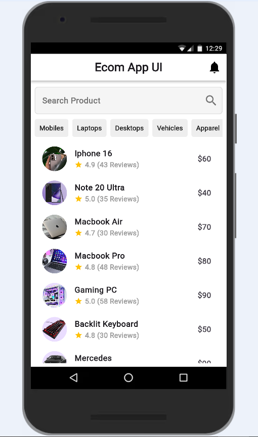

## Ecom App UI in Flutter

A simple Flutter assignment that demonstrates an E-commerce product listing UI with category chips and a product detail screen.

## Features

Clean home screen with search bar

Horizontal category list

Product list with ratings & price

Product detail page on tap

Network images support

## Concepts Used

StatelessWidget

ListView.builder

Navigator.push (screen navigation)

Passing data using constructor

Row, Column, Expanded, Padding

NetworkImage / Image.network

## How to Run
flutter pub get
flutter run

Output:

## Screenshot
## Screenshot

  
  

## Note:

This project is created for Flutter UI practice and focuses on layout, list rendering, and navigation.