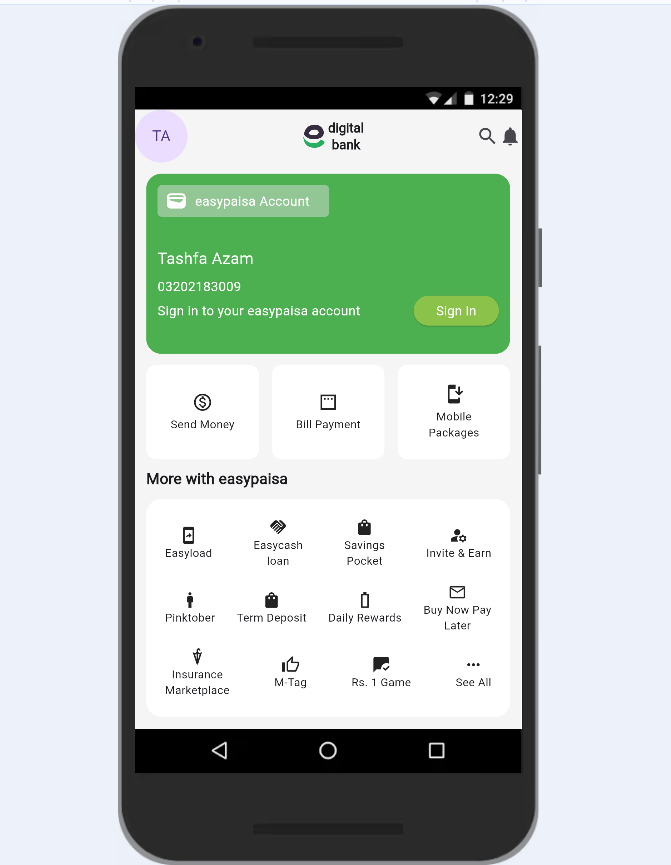

# EasyPaisa UI Clone

This is a **Flutter UI clone** of the EasyPaisa app, created as a practice assignment to strengthen my Flutter skills.  
It focuses on building layouts using **Rows, Columns, Containers, and Custom Widgets**.

---

## Features

- Responsive **Rows & Columns** layout
- **Containers** with custom styling
- **Stateless widgets** for modular UI
- Custom **Reusable Widgets** (`AccountCard`, `FeatureItem`, `QuickActionItem`)
- Proper **asset management** (images, icons, screenshots)

---

## Concepts Used

- **Flutter Basics:** Widgets, Scaffold, AppBar, Text, Image
- **Layouts:** Rows, Columns, Containers, Padding, Margins
- **Custom Widget:** Stateless 
- **UI Design:** Colors, Icons, Images, Fonts
- **Project Structure:** Clean folder organization (`lib/widgets`, `image`, `screenshot`, etc.)

---

## UI Preview

---

## Tech Stack

- **Language:** Dart  
- **Framework:** Flutter  

